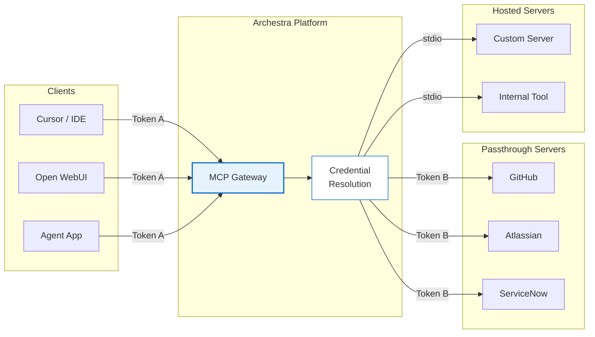
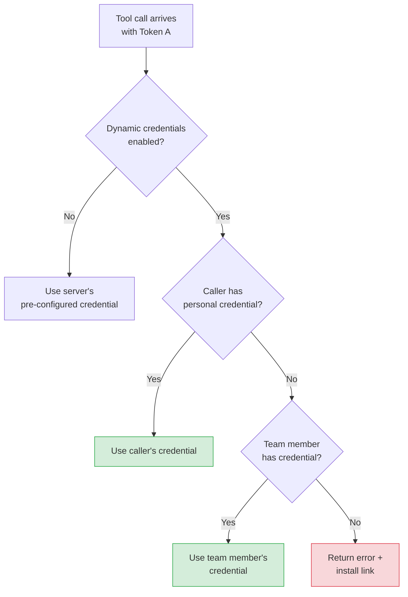

<!--
Check ../docs_writer_prompt.md before changing this file.
-->

Archestra's MCP Gateway handles authentication at two layers: it authenticates clients connecting to the gateway, and it separately manages credentials for the upstream MCP servers it orchestrates. Clients never see or handle upstream credentials directly.

## Gateway Authentication

The MCP Gateway supports four client authentication paths. They do not all present the same token to `POST /v1/mcp/<gateway-id>`:

- **OAuth 2.1** and **ID-JAG** both end with an Archestra-issued OAuth access token being sent to the gateway
- **JWKS** sends an external IdP JWT directly to the gateway
- **Bearer token** sends a static platform-managed token directly to the gateway. Newly generated tokens use `arch_<token>`. Legacy `archestra_<token>` values remain valid.

### OAuth 2.1

MCP-native clients such as Claude Desktop, Cursor, and Open WebUI authenticate automatically using the [MCP Authorization spec](https://modelcontextprotocol.io/specification/2025-11-25/basic/authorization). The gateway acts as both the resource server and the authorization server.

The gateway supports the following OAuth flows and client registration methods:

- **Authorization Code + PKCE**: The standard browser-based authorization flow. The user is redirected to a login and consent screen, and the client receives tokens upon approval.
- **DCR (RFC 7591)**: Clients can register dynamically at runtime by posting their metadata to `POST /api/auth/oauth2/register`. The gateway returns a `client_id` for subsequent authorization requests.
- **CIMD**: Clients can use an HTTPS URL as their `client_id`. The gateway fetches the client's metadata document from that URL, eliminating the need for a separate registration step.

Endpoint discovery is automatic. The gateway exposes standard well-known endpoints so clients can find the authorization and token URLs without any hardcoded configuration:

- `/.well-known/oauth-protected-resource` (RFC 9728)
- `/.well-known/oauth-authorization-server` (RFC 8414)

#### Token lifetime

Archestra returns the lifetime of its MCP OAuth access tokens through the standard `expires_in` field. The default lifetime is 1 year, which reduces unnecessary reconnects for MCP-native clients like desktop apps.

Admins can change this in **Settings > MCP**. The setting is organization-wide and applies to newly issued Archestra MCP OAuth 2.1 access tokens.

### Bearer Token

For direct API integrations, clients can authenticate using a static Bearer token with the header `Authorization: Bearer arch_<token>`. Legacy `archestra_<token>` values still authenticate correctly. Tokens can be scoped to a specific user, team, or organization. You can create and manage tokens in **Settings > Tokens**.

Bearer tokens authenticate the client to Archestra. They are not enterprise assertions by themselves. If a gateway also needs enterprise-managed upstream credentials, Archestra must still have a usable IdP token for the matched user.

For per-user access to downstream systems like GitHub or Jira, bearer tokens should usually be **personal user tokens**. Team and organization tokens can authenticate to the gateway, but they do not identify a specific user strongly enough for Archestra to broker per-user downstream credentials on their own.

### Enterprise-Managed Authorization (Identity Assertion JWT Authorization Grant, ID-JAG)

This option implements the MCP [Enterprise-Managed Authorization](https://modelcontextprotocol.io/extensions/auth/enterprise-managed-authorization) profile using an [Identity Assertion JWT Authorization Grant (ID-JAG)](https://datatracker.ietf.org/doc/html/draft-ietf-oauth-identity-assertion-authz-grant). It is designed for organizations that already use a corporate IdP to sign users into MCP clients. The identity provider must be able to:

- authenticate the user to the MCP client
- perform RFC 8693 token exchange to issue an ID-JAG
- sign that ID-JAG as a JWT that Archestra can validate through OIDC discovery or a JWKS endpoint

In this flow, the MCP client does not send the user's enterprise JWT directly to the gateway. Instead:

1. The user signs in to the MCP client with the enterprise IdP
2. The MCP client exchanges that identity assertion with the IdP for an ID-JAG
3. The MCP client sends the ID-JAG to Archestra's token endpoint using the JWT bearer grant
4. Archestra validates the ID-JAG against the configured IdP and returns an MCP access token
5. The MCP client calls the gateway with that MCP access token

Archestra supports the second leg of the flow generically at `POST /api/auth/oauth2/token` with:

- `grant_type=urn:ietf:params:oauth:grant-type:jwt-bearer`
- `assertion=<id-jag>`
- normal OAuth client authentication for the MCP client (`client_secret_basic`, `client_secret_post`, or `none` for public clients)

#### Requirements

- The MCP Gateway must be linked to an **OIDC** Identity Provider in Archestra
- The IdP-issued ID-JAG must be a JWT with header `typ=oauth-id-jag+jwt`
- The ID-JAG `aud` claim must match Archestra's OAuth issuer
- The ID-JAG `resource` claim must point to the target MCP Gateway URL (`/v1/mcp/<gateway-id>`)
- The ID-JAG `client_id` claim must match the authenticated MCP client
- The ID-JAG `scope` must include `mcp`
- The ID-JAG should include an `email` claim that matches an existing Archestra user account

Archestra binds the access token it issues to the specific MCP Gateway in the `resource` claim, so that token cannot be replayed against a different gateway.

### Enterprise Gateway Auth

For gateways linked to an OIDC identity provider, Archestra supports two enterprise auth paths in addition to standard OAuth and static bearer tokens:

- **ID-JAG**: the client sends an ID-JAG to `POST /api/auth/oauth2/token`, receives an Archestra-issued OAuth access token, then uses that token on `POST /v1/mcp/<gateway-id>`
- **JWKS**: the client sends an external IdP JWT directly to `POST /v1/mcp/<gateway-id>`, and Archestra validates it against the linked identity provider's JWKS

### MCP Gateway Example: Cursor with GitHub and Jira

Consider a gateway that exposes GitHub and Jira tools to Cursor.

- **Token A** authenticates Cursor to the Archestra MCP Gateway
- **Token B** authenticates Archestra to GitHub or Jira when the tool runs

Cursor can reach the gateway through four supported auth paths:

- **OAuth 2.1**: Cursor completes the standard MCP Authorization flow, receives an Archestra-issued access token, then calls the gateway with that token
- **ID-JAG**: Cursor sends an ID-JAG to Archestra's token endpoint, receives an Archestra-issued access token, then calls the gateway with that token
- **JWKS**: Cursor calls the gateway directly with an external IdP JWT, and Archestra validates it against the linked IdP JWKS
- **Bearer token**: Cursor calls the gateway directly with a static platform-managed token issued by Archestra

For downstream enterprise-managed credentials, these modes are not equivalent:

- **ID-JAG** and **JWKS** are the clearest enterprise patterns because they give Archestra a user-specific enterprise assertion during authentication
- **OAuth 2.1** also works when the authenticated Archestra user has a linked session with the same IdP
- **Bearer token** only works for enterprise-managed downstream credentials when it resolves to a specific user who already has a linked IdP session in Archestra

In practice, that means a **personal user token** can work with enterprise-managed downstream credentials, but a pure **team** or **organization** token does not carry enough user identity on its own to broker per-user GitHub or Jira credentials.

When a tool runs, Archestra still resolves **Token B** separately. For example:

1. Cursor authenticates to Archestra using OAuth, ID-JAG, JWKS, or a personal Archestra bearer token
2. Archestra identifies the user behind the request
3. Archestra asks the configured IdP or broker for a GitHub credential for that user
4. Archestra asks the same IdP or broker for a Jira credential for that user
5. Archestra injects the correct credential into each upstream MCP request

This is why a single gateway can front multiple upstream systems. Gateway authentication and upstream credential resolution are related, but they are separate steps.

### External IdP JWKS

Identity Providers (IdPs) configured in Archestra can also be used to authenticate external MCP clients. When an IdP is linked to an Archestra MCP Gateway, the gateway validates incoming JWT bearer tokens against the IdP's JWKS (JSON Web Key Set) endpoint and matches the caller to an Archestra user account. The same team-based access control that applies to Bearer tokens and OAuth also applies here — the JWT's email claim must correspond to an Archestra user who has permission to access the gateway.

After authentication, the gateway resolves credentials for the upstream MCP server. If the upstream server has its own credentials configured (e.g., a GitHub PAT or OAuth token), those are used. If no upstream credentials are configured, the gateway propagates the original JWT as an `Authorization: Bearer` header, enabling end-to-end identity propagation where the upstream server validates the same JWT against the IdP's JWKS. See [End-to-End JWKS](#end-to-end-jwks-without-gateway) below for how to build servers that consume propagated JWTs.

This credential resolution enables a powerful workflow: an admin installs upstream MCP servers (GitHub, Jira, etc.) with service credentials once, and any user who authenticates via their org's IdP can access those tools seamlessly — the gateway resolves the appropriate upstream token automatically. Both [static and per-user credentials](#upstream-credentials) work with JWKS authentication.

#### How It Works

1. Admin configures an OIDC Identity Provider in **Settings > [Identity Providers](/docs/platform-identity-providers)**
2. Admin creates an MCP Gateway and selects the Identity Provider to use for JWKS Auth
3. External MCP client obtains a JWT from the IdP (e.g., via client credentials flow or user login)
4. Client sends requests to the gateway with `Authorization: Bearer <jwt>`
5. Gateway discovers the JWKS URL from the IdP's OIDC discovery endpoint
6. Gateway validates the JWT signature, issuer, audience (IdP's client ID), and expiration
7. Gateway extracts the `email` claim from the JWT and matches it to an Archestra user account
8. Gateway resolves upstream credentials: if the server has its own credentials, those are used; otherwise the original JWT is propagated

#### Requirements

- The Identity Provider must be an **OIDC provider** (SAML providers do not support JWKS)
- The IdP must expose a standard OIDC discovery endpoint (`.well-known/openid-configuration`) with a `jwks_uri`
- The JWT `iss` claim must match the IdP's issuer URL
- The JWT `aud` claim must match the IdP's client ID (if configured)
- The JWT must contain an `email` claim that matches an existing Archestra user
- The user must have `profile:admin` permission or be a member of at least one team associated with the gateway they are trying to use

## Upstream Credentials

MCP servers that connect to external services like GitHub, Atlassian, or ServiceNow need their own credentials. Archestra manages this with a two-token model:

- **Token A** authenticates the client to the gateway using an Archestra OAuth access token, an external IdP JWT via JWKS, or a platform-managed bearer token such as `arch_<token>` (legacy `archestra_<token>` values also work).
- **Token B** authenticates the gateway to the upstream MCP server. This token is resolved and injected by Archestra at runtime.

The client only ever sends Token A. Archestra resolves Token B behind the scenes.

Credentials are configured when you install a server from the [MCP Catalog](/docs/platform-private-registry). There are two types of upstream credentials:

- **Static secrets**: API keys or personal access tokens that are set once at install time and used for all requests.
- **OAuth tokens**: Obtained by running an OAuth flow against the upstream provider during installation. Archestra stores both the access token and refresh token.
- **Enterprise-managed credentials**: Retrieved at tool-call time from an attached enterprise IdP when the IdP can mint or broker a downstream credential for the requested resource.

How credentials are delivered to the upstream server depends on the server type. For **passthrough** (remote) servers, Archestra sends the credential as an `Authorization: Bearer` header over HTTP. For **hosted** (local) servers running in Kubernetes, the gateway connects via stdio transport within the cluster and no auth headers are needed.

All credentials are stored in the secrets backend, which uses the database by default. For enterprise deployments, you can configure an [external secrets manager](/docs/platform-secrets-management).

### Per-User Credentials

By default, each MCP server installation has a single credential that is shared by all callers.

When you enable "Resolve at call time" on a server, Archestra resolves the credential dynamically based on the caller's identity. This enables multi-tenant setups where each developer uses their own GitHub PAT or each team member uses their own Jira access token.

When dynamic credentials are enabled, Archestra resolves them in priority order:

1. The calling user's own personal credential (highest priority)
2. A credential owned by a team member on the same team
3. If no credential is found, an error is returned with an install link

### Static Assignment Scope Rules

When you pin a tool to a specific installed MCP server connection instead of using dynamic resolution, Archestra validates the connection against the target Agent or MCP Gateway scope:

- **Team-installed connection**: can only be assigned to a **team-scoped** Agent or MCP Gateway that includes that same team
- **Personal connection**: can only be assigned to a resource the connection owner could access directly
- **Dynamic / resolve at call time**: skips static-owner checks because Archestra resolves credentials per caller at execution time

This means a team-shared connection is governed by the team it is shared with, not by the individual who originally installed it. Personal connections still follow the connection owner's access boundary.

### Enterprise-Managed Credentials

Enterprise-managed credentials are an upstream credential strategy. Instead of storing downstream credentials inside Archestra, Archestra asks the configured identity provider for a credential at tool-call time and injects it into the MCP request.

This is different from both gateway JWKS and ID-JAG:

- **JWKS** authenticates the caller to Archestra
- **ID-JAG** exchanges an enterprise assertion for an Archestra-issued MCP access token
- **Enterprise-managed credentials** obtain the credential used for the downstream MCP tool call itself

Configuration is split across three places:

- **Identity Provider**: how Archestra authenticates to the IdP for credential exchange
- **MCP catalog item**: what downstream resource should be requested and how the returned credential should be injected
- **Tool assignment**: choose `Resolve at call time`

This model works best for remote MCP servers and local MCP servers using HTTP transport. Local stdio servers do not support per-request enterprise-managed credential injection.

For MCP Gateways, enterprise-managed credentials use the caller identity that was established at the gateway:

- **JWKS**: Archestra can use the incoming external IdP JWT directly
- **ID-JAG**: Archestra uses the enterprise assertion path associated with the gateway's Identity Provider
- **OAuth 2.1**: Archestra resolves the authenticated Archestra user and then uses that user's linked IdP session, if one exists
- **Bearer token**: Archestra can only broker downstream enterprise-managed credentials if the token maps to a specific user with a linked IdP session

For external MCP clients such as Cursor, **ID-JAG** and **JWKS** are usually the clearest options when you want per-user access to upstream systems like GitHub or Jira.

### Missing Credentials

When no credential can be resolved for a caller, the gateway returns an actionable error message that includes a direct link to install the MCP server with their own credentials:

> Authentication required for "GitHub MCP Server".
> No credentials found for your account (user: alice@company.com).
> Set up credentials: https://archestra.company.com/mcp/registry?install=abc-123

The user follows the link, installs the server with their credentials, and retries the tool call.

### Auto-Refresh

For upstream servers that use OAuth, Archestra handles the token lifecycle automatically. When the upstream server returns a 401, Archestra uses the stored refresh token to obtain a new access token and retries the request without any user intervention. Refresh failures are tracked per server and are visible in the MCP server status page.

## Custom Header Passthrough

MCP Gateways can pass through client request headers to downstream MCP servers. This is useful for passing correlation IDs, tenant identifiers, or other application-specific headers through the gateway.

Configure the allowlist in the MCP Gateway's **Advanced** section under **Custom Header Passthrough**. Only headers whose names appear in the allowlist are forwarded; all others are dropped. Header names are case-insensitive and stored in lowercase.

Hop-by-hop headers (`Connection`, `Transfer-Encoding`, `Upgrade`, etc.) and protocol-level headers (`Host`, `Content-Length`) cannot be added to the allowlist. Application-level headers like `Authorization` and `Cookie` are allowed — adding them to the allowlist is an explicit opt-in.

Passthrough headers do not override credentials already set by Archestra's upstream credential resolution. If a header name conflicts with an existing credential header (e.g., `Authorization`), the credential takes precedence.

Passthrough headers only apply to HTTP-based transports (streamable-http and remote servers). Stdio-based servers do not support HTTP headers.

## Building MCP Servers

There are three authentication patterns available for MCP servers deployed through Archestra, depending on whether the server needs external credentials and whether those credentials differ per user.

| Pattern            | When to use                                      | How it works                                                                 |
| ------------------ | ------------------------------------------------ | ---------------------------------------------------------------------------- |
| No auth            | Internal tools with no external API dependencies | Hosted in K8s, gateway connects via stdio or streamable-http                 |
| Static credentials | Shared API key or service account                | User provides credentials at install time, Archestra stores and injects them |
| OAuth 2.1          | Per-user access to a SaaS API                    | Full OAuth flow at install, automatic token refresh by Archestra             |

### No Auth (Hosted)

For servers that don't call external APIs, no authentication is needed. The server runs in Archestra's Kubernetes cluster and the gateway connects to it via stdio or streamable-http transport. Since both the gateway and the server are in the same cluster, they share the same trust boundary. See [MCP Orchestrator](/docs/platform-orchestrator) for details on how hosted servers are managed.

### Static Credentials

For servers that need a shared API key or service token:

1. Define the required credential fields in the catalog entry (e.g., `JIRA_API_TOKEN`, `BASE_URL`)
2. Users provide the values when installing the server from the catalog
3. Archestra securely stores the credentials and passes them to the server at runtime

All tool calls through the gateway use the same credential.

### OAuth 2.1

For servers that connect to a SaaS API where each user has their own account (GitHub, Salesforce, etc.).

Your server (or its OAuth provider) needs to expose two things:

- A `/.well-known/oauth-protected-resource` endpoint that points to the authorization server
- A 401 response with a `WWW-Authenticate` header when tokens are missing or expired

Archestra handles everything else: endpoint discovery, client registration, the authorization code flow with PKCE, token storage, and automatic refresh when tokens expire.

Your server receives an `Authorization: Bearer <access_token>` header with each request from the gateway.

### End-to-End JWKS (Without Gateway)

When an MCP Gateway is configured with an [External IdP](#external-idp-jwks), the gateway propagates the caller's JWT to upstream MCP servers. Your MCP server receives the JWT as an `Authorization: Bearer` header and can validate it directly against the IdP's JWKS endpoint — statelessly, without any Archestra-specific integration.

This pattern is useful when your MCP server needs to enforce its own access control based on IdP claims (roles, groups, etc.), or when the server is also deployed outside of Archestra and needs to authenticate users independently.

See [Building Enterprise-Ready MCP Servers with JWKS and Identity Providers](https://archestra.ai/blog/enterprise-mcp-servers-jwks) for a full walkthrough with code examples.

## ID-JAG vs JWKS

Enterprise-Managed Authorization and JWKS-based authentication both rely on enterprise-issued JWTs, but they solve different problems.

**ID-JAG** is a token exchange pattern. The MCP client first obtains an enterprise-issued identity assertion, exchanges it for an ID-JAG, and then exchanges that ID-JAG with Archestra for an MCP access token. Archestra validates the ID-JAG and issues a new gateway token scoped to the target MCP Gateway.

**JWKS authentication** is direct JWT validation. The MCP client sends the enterprise JWT directly to Archestra, and Archestra validates that JWT against the IdP's JWKS endpoint on each request.

Use **ID-JAG** when:

- your MCP client participates in enterprise-managed authorization
- you want Archestra to mint its own MCP access token for the gateway
- you want the resulting gateway token bound to a specific MCP resource

Use **JWKS** when:

- your MCP client already has a usable bearer JWT from the enterprise IdP
- you want direct JWT validation without a token exchange step
- you want the original enterprise JWT propagated to upstream MCP servers

In short: **ID-JAG** exchanges an enterprise assertion for an Archestra-issued MCP token, while **JWKS** validates and forwards the enterprise JWT directly.
